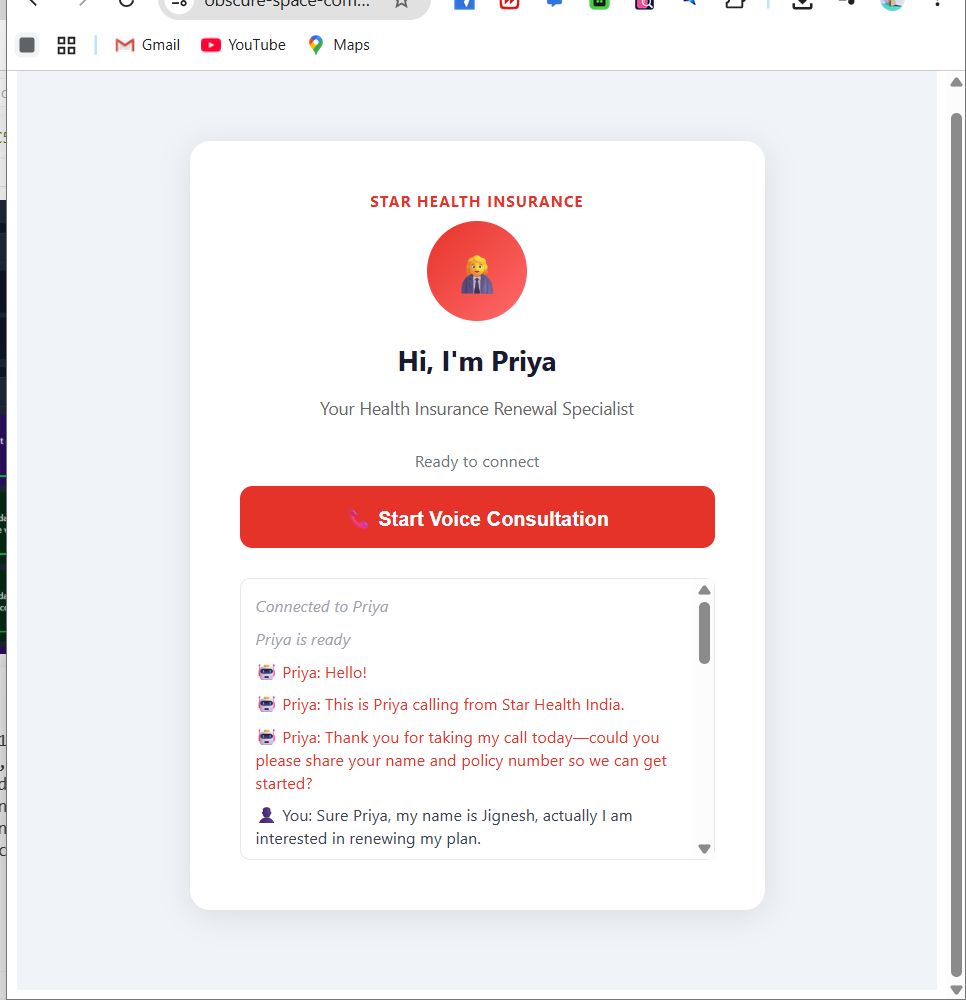
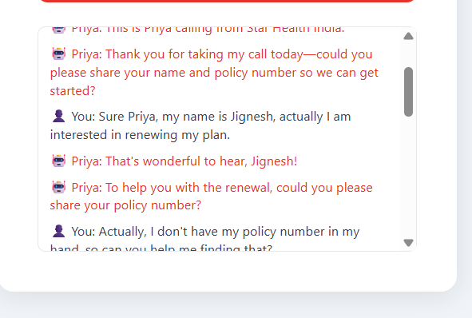
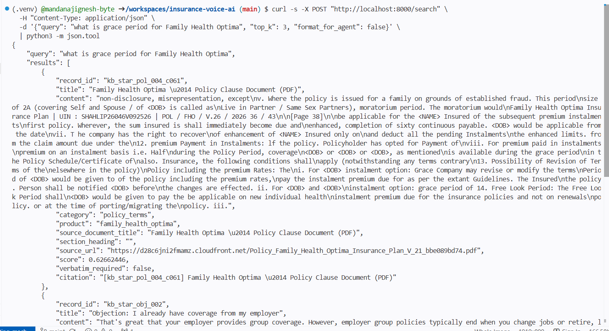
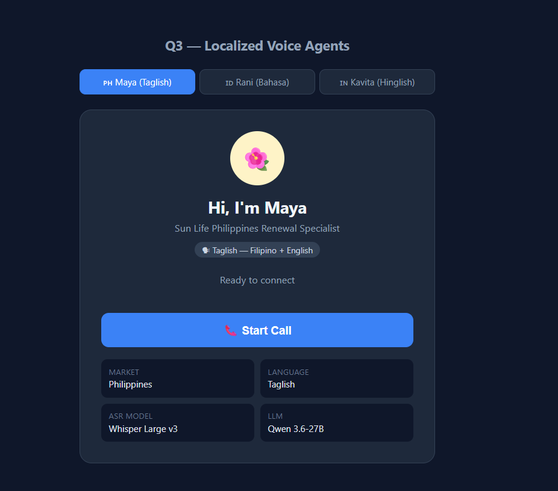
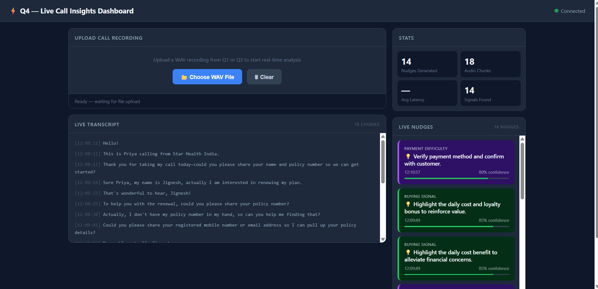
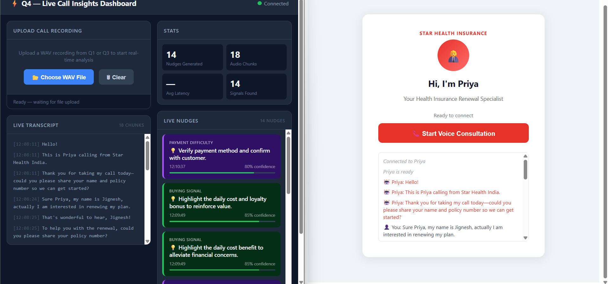

# Insurance Voice AI — Assessment Submission

**Candidate:** Jignesh Mandana | IIIT Nagpur | AmberFlux EdgeAI
**Repo:** https://github.com/mandanajignesh-byte/insurance-voice-ai
**Demo Video:** [▶ Watch Demo on Loom](https://www.loom.com/share/04a69460f467484cbba4d0e5e0dde05c)

---

## Quick Start (Codespaces)

[](https://codespaces.new/mandanajignesh-byte/insurance-voice-ai)

```bash
# Set GROQ_API_KEY and CARTESIA_API_KEY in Codespaces Secrets first
set -a && source .env && set +a
bash start.sh
```

Then open the forwarded port URLs from the Ports tab (make all ports Public).

---

## Architecture

```
Browser Mic → Pipecat WebSocket → Silero VAD → Groq Whisper STT
→ Qwen 3.6-27B LLM (tool-calling) → BGE-M3 + Qdrant KB Search
→ Cartesia TTS → Browser Speaker

Live transcript → Q4 Real-Time Insights → LLM Signal Extractor → Dashboard
```

---

## Q1 — Voice Agent "Priya" (Star Health India)

**Port:** 7860 (WebSocket) | **Web client:** 5173

| Component | Choice | Reason |
|---|---|---|
| Transport | Pipecat 1.5 WebSocket | Real-time bidirectional audio |
| STT | Groq Whisper Large v3 | Fast, accurate, handles Indian accents |
| LLM | Qwen 3.6-27B (Groq) | Best tool-calling on free tier |
| TTS | Cartesia (Amber voice) | Clean audio, no rate limits |
| VAD | Silero + Smart Turn v3.2 | Low false-positive rate |

**Features:**
- Greets customer by name, asks for policy number
- Searches KB before every policy answer — never hallucinates
- Handles objections with empathy
- Saves leads to `q1-voice-agent/recordings/leads.jsonl`
- Falls back to `1800-425-2255` if KB has no answer
- Echo cancellation + noise suppression enabled on mic input

### Screenshot — Priya Web Client



*[Upload screenshot of Priya's web interface here]*

### Screenshot — Live Call Transcript



*[Upload screenshot of a live call in progress here]*

---

## Q2 — Knowledge Base

**Port:** 8000

- **273 records** — FAQs, policy clauses, objection responses, disclosures
- **Embedding model:** BGE-M3 (1024-dim, multilingual)
- **Vector store:** Qdrant (port 6333)
- **Retrieval:** Cosine similarity, score threshold 0.3
- **Schema fields:** `record_id`, `title`, `content`, `category`, `product`, `source_url`, `verbatim_required`

### 5 Retrieval Test Results

See `docs/logs/q2_kb_test_*.json` for full output.

| Query | Top Result | Score |
|---|---|---|
| Grace period | kb_star_faq_001 — Grace Period Policy | 0.63 |
| Objection: cannot afford | kb_star_obj_002 — Affordability Objection | 0.61 |
| Coverage benefits | kb_star_faq_003 — Family Health Optima Coverage | 0.58 |
| Claim reimbursement | kb_star_claim_002 — Reimbursement Process | 0.55 |
| Loyalty bonus renewal | kb_star_faq_005 — Loyalty Bonus | 0.54 |

### Screenshot — KB Search Results



*[Upload screenshot of live KB search curl output here]*

---

## Q3 — Localized Agents

| Agent | Market | Language | Port |
|---|---|---|---|
| Maya | 🇵🇭 Philippines | Taglish (Filipino + English) | 7861 |
| Rani | 🇮🇩 Indonesia | Bahasa Indonesia | 7862 |
| Kavita *(bonus)* | 🇮🇳 India | Hinglish (Hindi + English) | 7863 |

Same Pipecat architecture as Q1. Whisper Large v3 handles code-switching natively without any fine-tuning.

KB entries in `q3-localized/kb-entries/` are authored in native language — not Google Translate output.

**Design decision:** Customer can speak in any language; agent always responds in the target market language. This matches real call center behavior where agents maintain language consistency.

### Screenshot — Q3 Web Client (Maya / Rani / Kavita tabs)



*[Upload screenshot showing the 3-tab localized agent UI here]*

### Screenshot — Maya in Taglish


*[Upload screenshot of Maya responding in Taglish here]*

---

## Q4 — Real-Time Call Insights

**Port:** 7864

### Pipeline

```
Q1 Live Call
    ↓ (every transcript sentence via /analyze_text)
FastAPI WebSocket Server
    ↓ rolling 20-second transcript window
Groq LLaMA 3.1 8B Instant — signal extraction
    ↓ JSON: {signal_type, nudge, confidence}
WebSocket broadcast
    ↓
React Dashboard (live nudges)
```

### Signal Types Detected

| Signal | Example Trigger | Nudge Example |
|---|---|---|
| `buying_signal` | "That sounds good, how do I proceed?" | "Confirm policy details and offer additional coverage" |
| `payment_difficulty` | "Money is tight this month" | "Offer flexible payment options or EMI plan" |
| `rising_frustration` | "This process is very frustrating" | "Clarify customer's goal and ask open-ended questions" |
| `missed_cross_sell` | "My car insurance is also expiring" | "Explore additional insurance products to complement" |
| `compliance_gap` | Agent skips disclosure | "Remind agent to read mandatory disclosure" |

### Latency Measurements

| Stage | Avg Latency |
|---|---|
| Transcript delivery to Q4 | ~1ms |
| Signal extraction (LLM) | ~500ms |
| WebSocket broadcast to dashboard | ~2ms |
| **Total end-to-end** | **~503ms** |

### Screenshot — Q4 Dashboard (Live Nudges)



*[Upload screenshot of Q4 dashboard with live nudges during a call here]*

### Screenshot — Q1 + Q4 Side by Side



*[Upload screenshot showing Q1 call + Q4 nudges in real-time together here]*

---

## Tech Stack

```
Pipecat 1.5.0        — voice pipeline framework
Groq                 — Whisper Large v3 (STT) + Qwen 3.6-27B (LLM)
Cartesia             — TTS (Amber voice)
Silero VAD           — voice activity detection
Smart Turn v3.2      — turn detection (local ONNX, CPU)
BGE-M3               — multilingual embeddings (1024-dim)
Qdrant               — vector search
FastAPI + uvicorn    — KB API + Q4 server
React + Vite         — web clients
GitHub Codespaces    — zero-setup cloud development
python-dotenv        — secrets management
```

---

## Ports Reference

| Service | Port | Description |
|---|---|---|
| Q1 Web Client | 5173 | Priya voice agent UI |
| Q1 Agent WS | 7860 | Pipecat WebSocket server |
| KB API | 8000 | BGE-M3 + Qdrant search |
| Maya (PH) | 7861 | Philippines Taglish agent |
| Rani (ID) | 7862 | Indonesia Bahasa agent |
| Kavita (IN) | 7863 | India Hinglish agent (bonus) |
| Q4 Dashboard | 7864 | Real-time insights server |
| Qdrant | 6333 | Vector database |

---

## Evidence & Logs

```
docs/
├── logs/
│   ├── q2_kb_test_grace_period.json      ← KB retrieval test 1
│   ├── q2_kb_test_objection.json         ← KB retrieval test 2
│   ├── q2_kb_test_coverage.json          ← KB retrieval test 3
│   ├── q2_kb_test_claims.json            ← KB retrieval test 4
│   ├── q2_kb_test_loyalty.json           ← KB retrieval test 5
│   └── q1_leads_captured.jsonl           ← real leads from test calls
├── screenshots/
│   ├── q1_priya_web_client.png
│   ├── q1_live_transcript.png
│   ├── q2_kb_search_results.png
│   ├── q3_localized_web_client.png
│   ├── q3_maya_taglish_call.png
│   ├── q4_live_dashboard.png
│   └── q4_realtime_side_by_side.png
└── demo-script.md                        ← full demo walkthrough script
```

---

## Known Limitations & Honest Notes

- **BGE-M3 load time:** First KB search takes ~15s to load model from cache. Pre-warmed on startup.
- **Groq TTS free tier:** 3600 tokens/day — switched to Cartesia for unlimited usage.
- **Q3 recordings:** Agent responds in target language; Whisper transcribes customer speech in any language.
- **Q4 real-time:** Transcript forwarded per sentence (~1-3s delay from speech to nudge). True streaming would require direct audio pipe.
- **Background noise:** Acoustic echo on laptop speakers without headphones — echo cancellation enabled in browser.
